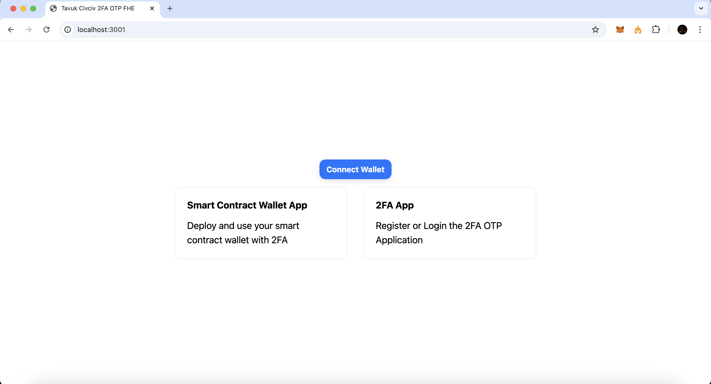
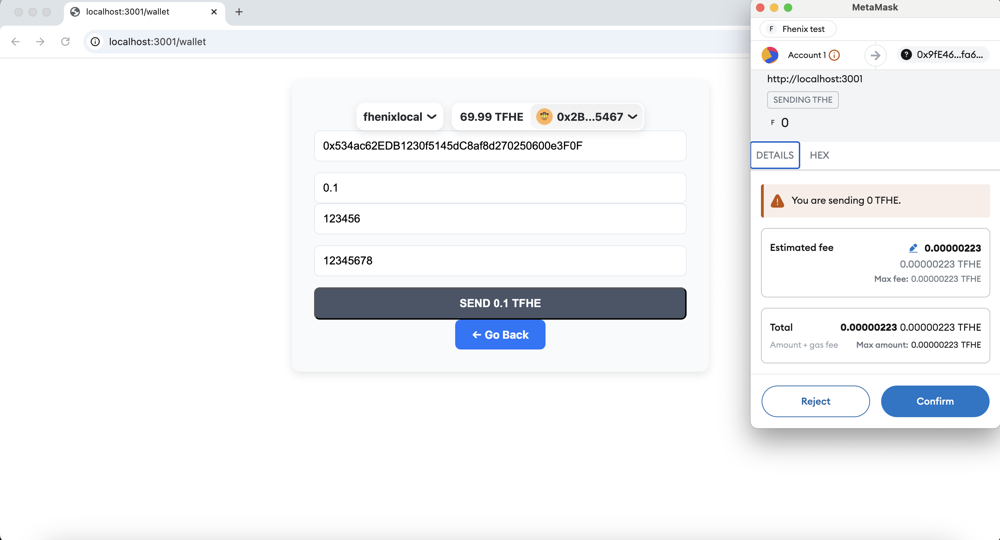
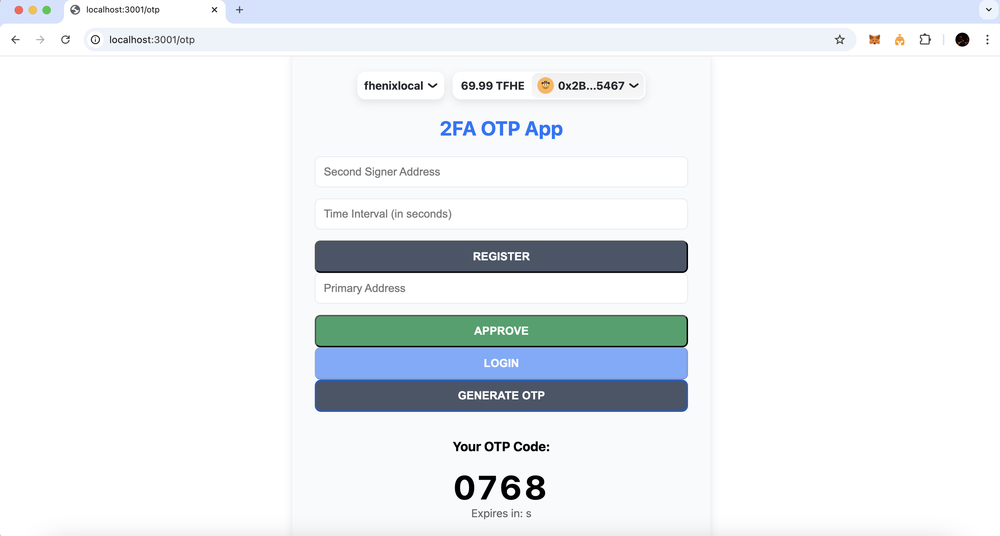

# Tavuk Civciv
2FA FHE Time-based One-time Password App

---

## Table of Contents

- [Introduction](#introduction)
- [Project Overview](#project-overview)
- [Contract Review](#contract-review)
  - [1. TwoFactorAuth.sol](#1-twofactorauthsol)
  - [2. TOTPWallet.sol](#2-totpwalletsol)
  - [3. TwoFactorAuthTOTP.sol](#3-twofactorauthtotpsol)
- [User Logic](#user-logic)
  - [Registration Phase](#registration-phase)
  - [Login Phase](#login-phase)
  - [Transaction Execution Phase](#transaction-execution-phase)
- [Future Improvements](#future-enhancements)
- [Frontend](#frontend)
- [Installation and Usage](#installation-and-usage)
- [Conclusion](#conclusion)
- [License](#license)

---

## Introduction

This project implements a decentralized two-factor authentication (2FA) system using Fhenix. By integrating Time-based One-Time Passwords (TOTP) and Fully Homomorphic Encryption (FHE), we provide a secure and decentralized method for user authentication and transaction authorization without relying on centralized servers.

**_Note:_** The Project is not complete with smooth UI. UI integration has problems. OTP Randomness and generation is pseudo. UI is not complete. Contracts are not the best version.

---

## Project Overview

The project consists of three main smart contracts:

1. **TwoFactorAuth.sol**: Implements 2FA by requiring approvals from two separate Ethereum addresses—a primary address and a second signer.

2. **TOTPWallet.sol**: A smart contract wallet that uses TOTP for transaction authorization for demonstration of the 2FA, with TOTP validation performed using FHE to ensure confidentiality.

3. **TwoFactorAuthTOTP.sol**: Integrates the above contracts to provide a comprehensive 2FA system using encrypted OTPs.

---

## Contract Review

### 1. TwoFactorAuth.sol

**Purpose**: Implements two-factor authentication using two different Ethereum addresses to enhance security.

**Key Components**:

- **User Struct**: Stores user information such as primary and secondary addresses, approval times, and status.
- **Functions**:
  - `register()`: Registers the primary and secondary addresses along with the approval time interval of the OTP.
  - `requestApproval()`: Primary user initiates a login request.
  - `approve()`: Second signer approves the login request within the specified time interval.
  - `login()`: Primary user completes the login process after approval.
  - `updateSecondSigner()`: Updates the second signer address.
  - `updateTimeInterval()`: Updates the time interval for approvals.
  - `isApproved()`: Checks if the second signature is approved and not expired.
- **Events**: Emitted for key actions to facilitate frontend interactions and logging.

### 2. TOTPWallet.sol

**Purpose**: A simple smart contract wallet for demonstration that uses TOTP for transaction authorization, leveraging FHE for secure on-chain processing of OTPs.

**Key Components**:

- **Encrypted Secret Key**: Stored securely using FHE to generate and validate TOTPs.
- **Functions**:
  - `changeSecretKey()`: Allows the owner to update the encrypted secret key.
  - `executeTransaction()`: Validates the TOTP and executes the transaction if valid.
  - `validateTOTP()`: Internal function to validate the provided TOTP using FHE operations.
  - `viewSecretKey()`: Allows authorized users to view the encrypted secret key (placeholder for FHE re-encryption functionality).
  - `isValidSignature()`: Verifies EIP712 signatures for authorization.
- **Modifiers**: `onlyOwner` ensures that only the contract owner can execute certain functions.
- **Events**: `TransactionExecuted` is emitted upon successful transaction execution.

### 3. TwoFactorAuthTOTP.sol

**Purpose**: Integrates `TwoFactorAuth` and `TOTPWallet` to provide a seamless 2FA experience using encrypted OTPs.

**Key Components**:

- **Mappings**: Stores encrypted OTPs for each user.
- **Functions**:
  - `generateEncryptedOTP()`: Generates and encrypts a 4-digit OTP using FHE.
  - `verifyEncryptedOTP()`: Verifies the encrypted OTP by interacting with `TOTPWallet`.
  - `loginWithTwoFactorAuth()`: Orchestrates the 2FA login process by combining approval and OTP verification.
- **Events**: `OTPGenerated` and `UserLoggedIn` facilitate frontend updates and logging.

---

## User Logic

### Registration Phase

1. **Connect Primary Wallet**: User connects their primary Ethereum wallet to the decentralized application (dApp).

2. **Assign Second Signer**: User provides a secondary Ethereum address to act as a second signer for approvals.

3. **Set Time Interval**: User specifies the time interval (in seconds) during which approvals are valid.

4. **Register**: User calls the `register()` function on the `TwoFactorAuth` contract to store their information on-chain.

### Login Phase

1. **Request Approval**:
   - User initiates the login process by calling `requestApproval()` on the `TwoFactorAuth` contract.
   - An `ApprovalRequested` event is emitted, notifying the second signer.

2. **Second Signer Approval**:
   - The second signer receives a notification and connects their wallet to the dApp.
   - Second signer calls `approve()` on the `TwoFactorAuth` contract for the primary user's address.

3. **Generate Encrypted OTP**:
   - Primary user calls `generateEncryptedOTP()` on the `TwoFactorAuthTOTP` contract.
   - An OTP is generated and encrypted using FHE.

4. **Verify Encrypted OTP**:
   - User calls `verifyEncryptedOTP()` with the timestamp.
   - OTP is validated via the `TOTPWallet` contract.
   - Upon successful validation, the user gains access.

### Transaction Execution Phase

1. **Initiate Transaction**:
   - User specifies the recipient address and amount.
   - Calls `executeTransaction()` on the `TOTPWallet` contract, providing the encrypted OTP and timestamp.

2. **Validation and Execution**:
   - The contract validates the OTP using FHE.
   - If valid, the transaction is executed, and a `TransactionExecuted` event is emitted.
   - The validation logic:
   ```js
    euint32 encryptedMultiplication = FHE.mul(encryptedSecretKey, encryptedTimeStep);
    euint32 encryptedDivision = FHE.div(encryptedMultiplication, FHE.asEuint32(1000000));
    euint32 encryptedModulo = FHE.sub(encryptedMultiplication, FHE.mul(encryptedDivision, FHE.asEuint32(1000000)));

    euint32 encryptedProvidedTOTP = FHE.asEuint32(_encryptedTOTP);

    ebool comparisonResult = FHE.eq(encryptedModulo, encryptedProvidedTOTP);

    isValid = FHE.decrypt(comparisonResult);
   ```

---

## Future Enhancements

- **Confidentiality via FHE**: By requiring approvals from two separate addresses and encrypted OTPs, the system significantly reduces unauthorized access risks. Use sealing and eaddress for confidentality.

- **Decentralization**: All authentication processes need to be on-chain like random OTP's etc. aligning with blockchain's trustless and decentralized principles.

- **UI/UX Empowerment**: Implement flawless and smooth UI

- **Scalability**: The modular design allows for future enhancements and integrations, such as additional authentication factors.

---


## Frontend

Includes 3 Pages for simplicity:

- Homepage:

- Wallet:

- 2FA APP:



---

## Installation and Usage

The project is built on [Fhenix Hardhat Template](https://github.com/FhenixProtocol/fhenix-hardhat-example)

- Use instructions [here](https://github.com/FhenixProtocol/fhenix-hardhat-example?tab=readme-ov-file#quick-start).
- You need to have running Docker to run the local testnet.
- Front end is Rainbow Kit Template, the front end readme file and instructions is [here](./frontend/README.md)